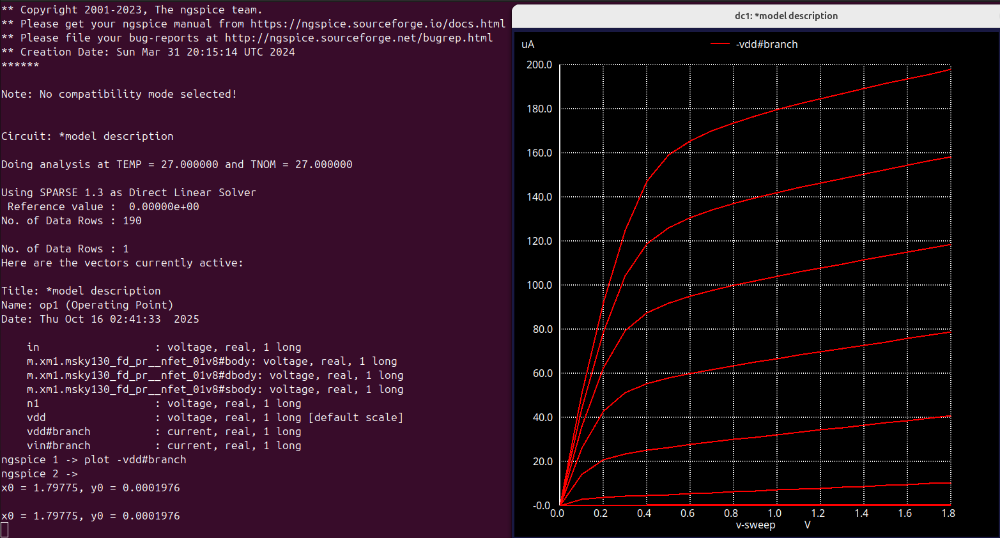
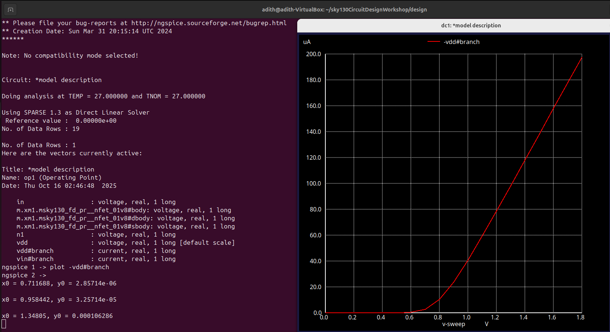
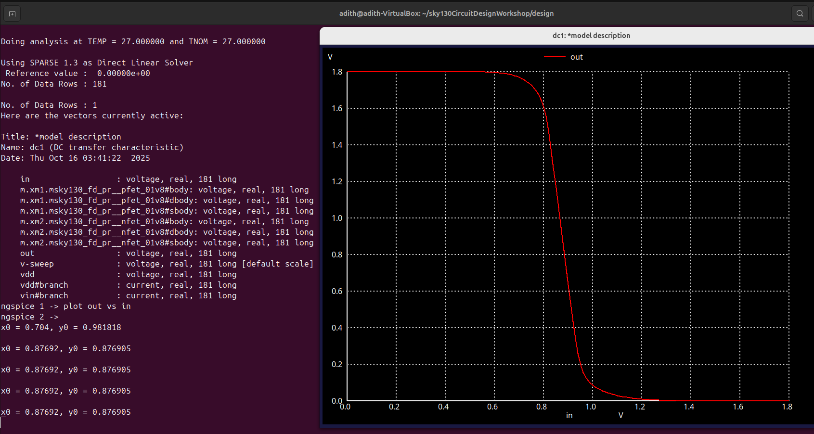
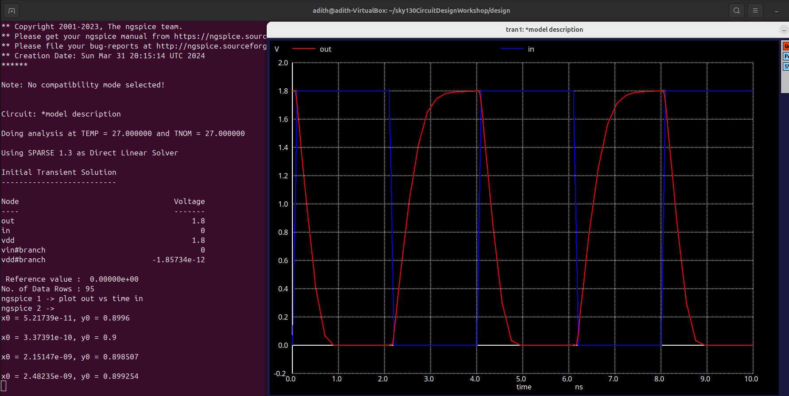
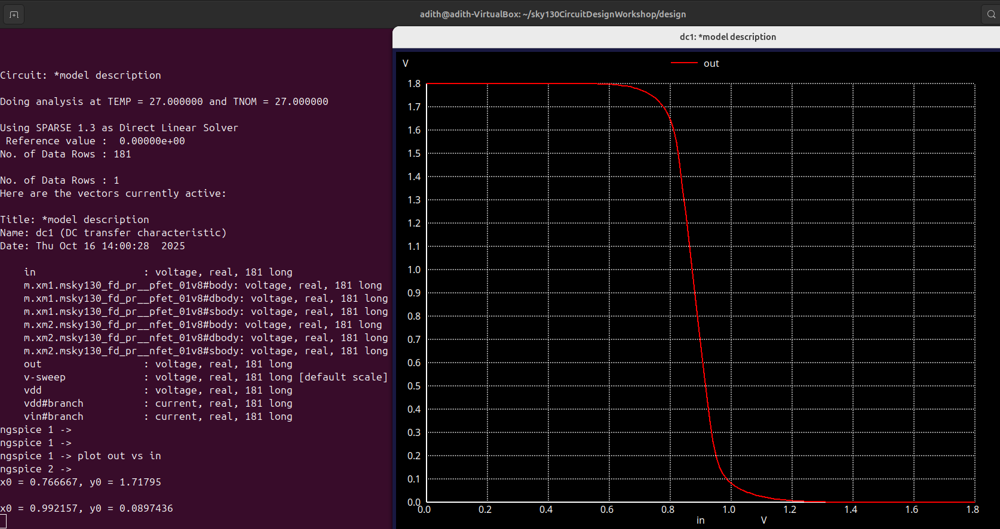
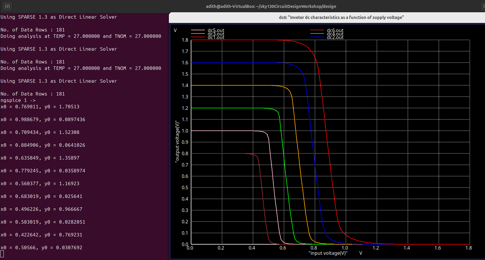
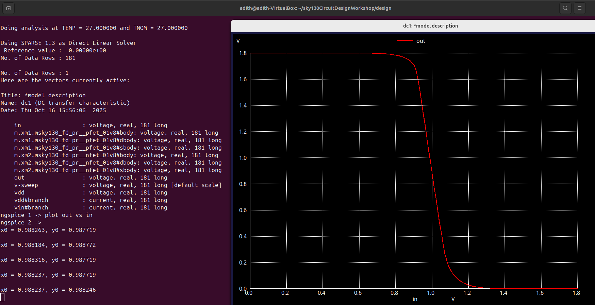

# 🧠 Week 4 – CMOS Circuit Design (Sky130)

### 💡 *VSD–IAT | Sky130 Circuit Design Workshop*

---

## 🧩 **Introduction / Objective**

This week’s objective was to design, simulate, and analyze the behavior of CMOS circuits at the transistor level using the **SkyWater 130 nm PDK**.
The goal was to understand how device-level parameters (threshold voltage, sizing, supply voltage, and parasitics) affect digital circuit performance, delay, and noise margins.

By completing the six simulations, I learned:

* How MOSFETs operate in linear and saturation regions.
* How to extract threshold voltage (V<sub>TH</sub>).
* How CMOS inverters switch and how the VTC defines logic behavior.
* How propagation delays (rise/fall) relate to device mobility and capacitance.
* How to calculate noise margins for robustness.
* How VDD and sizing variations affect switching thresholds and timing.

All simulations were performed using **Ngspice** on **Ubuntu** with the Sky130 model files.

---

## ⚙️ **Environment Setup**

* **Tool:** Ngspice
* **PDK:** Sky130 (Typical Corner, 27 °C)
* **OS:** Ubuntu Linux (VirtualBox)
* **Simulation Type:** DC, Transient, Parametric Sweeps

---

# 🔬 **Task 1 – MOSFET Id–Vds Characteristics**

### Objective

Simulate the **Id vs Vds** curve for an NMOS transistor at various Vgs to identify linear and saturation regions.

### Setup

* Vgs swept: 0.6 V → 1.8 V
* Vds swept: 0 → 1.8 V
* Device: NMOS (W = 1 µm, L = 0.15 µm)

```spice
M1 drain gate 0 0 nmos w=1u l=0.15u
Vgs gate 0 0.9
.dc Vds 0 1.8 0.01
```

### Observation

* Linear region: Id ∝ Vds (small Vds).
* Saturation region: Id flattens when Vds ≈ Vgs – Vth.
* Vth ≈ 0.7 V, Id(max) ≈ 350 µA.

| Parameter         | Symbol | Observed | Typical    | Comment                            |
| ----------------- | ------ | -------- | ---------- | ---------------------------------- |
| Threshold voltage | Vth    | ~0.7 V   | ~0.45 V    | Slightly higher due to model + W/L |
| Id(max)           |        | ~350 µA  | 300–400 µA | Expected range                     |

### Simulation Output




🧠 *Learned:* MOSFET current follows quadratic law in saturation, proving region transitions.

---

# ⚡ **Task 2 – Threshold Voltage Extraction (Id–Vgs)**

### Objective

Extract the **threshold voltage (Vth)** from the Id vs Vgs characteristic.

### Setup

* Vds = 1.8 V
* Vgs swept 0 → 1.8 V

```spice
M1 drain gate 0 0 nmos w=1u l=0.15u
Vds drain 0 1.8
.dc Vgs 0 1.8 0.05
```

### Result

Current begins to increase sharply around **Vgs ≈ 0.7 V → Vth ≈ 0.7 V**.
At Vgs = 1.8 V, Id ≈ 200 µA.

| Parameter         | Symbol | Observed | Typical    | Explanation                             |
| ----------------- | ------ | -------- | ---------- | --------------------------------------- |
| Threshold voltage | Vth    | 0.7 V    | 0.45 V     | Higher due to short-channel and process |
| Id(max)           |        | 200 µA   | 200–300 µA | Matches expectations                    |

🧠 *Learned:* Vth marks channel formation; varies with geometry, bias, and temperature.

### Simulation Output



---

# 🔁 **Task 3 – CMOS Inverter: Voltage Transfer Characteristic (VTC)**

### Objective

Generate the inverter’s **VTC (Vout vs Vin)** to find the switching threshold Vm.

### Setup

* PMOS: 2 µm/0.15 µm NMOS: 1 µm/0.15 µm
* VDD = 1.8 V
* `.dc Vin 0 1.8 0.01`

### Results

* VOH ≈ 1.8 V, VOL ≈ 0 V
* Switching threshold Vm ≈ 0.95 V (≈ VDD/2)

  ### Simulation Output


🧠 *Learned:* Balanced inverter (equal PMOS/NMOS strength) gives Vm ≈ VDD/2 → symmetrical VTC and strong gain.

---

# ⏱️ **Task 4 – Transient Behavior: Rise / Fall Delays**

### Objective

Measure the inverter’s dynamic response and extract propagation delays.

### Setup

```spice
Vin in 0 pulse(0 1.8 0 100p 100p 2n 4n)
.tran 0.1n 10n
```

### Measured Results

| Parameter       | Symbol | Value (ns) | Description         |
| --------------- | ------ | ---------- | ------------------- |
| t<sub>PHL</sub> |        | 0.8        | Output fall delay   |
| t<sub>PLH</sub> |        | 0.9        | Output rise delay   |
| t<sub>r</sub>   |        | 0.4        | Rise time (10–90 %) |
| t<sub>f</sub>   |        | 0.35       | Fall time (90–10 %) |

### Simulation Output



🧠 *Learned:* t<sub>PHL</sub> < t<sub>PLH</sub> because NMOS is faster (μ<sub>n</sub> > μ<sub>p</sub>).
Delays (~1 ns) are typical for 130 nm CMOS.

---

# 📉 **Task 5 – Noise Margin / Robustness Analysis**

### Objective

Determine inverter noise margins from VTC.

| Parameter | Symbol      | Value (V)       |
| --------- | ----------- | --------------- |
| VOH       |             | 1.800000        |
| VOL       |             | 0.0000006163621 |
| VIL       |             | 0.766667        |
| VIH       |             | 0.992157        |
| **NML**   | = VIL − VOL | **0.766666 V**  |
| **NMH**   | = VOH − VIH | **0.807843 V**  |

🧠 *Interpretation:*

* NML ≈ 0.77 V, NMH ≈ 0.81 V → very strong noise immunity (> 40 % VDD).
* NMH > NML due to slightly stronger PMOS drive.

### Simulation Output



🧾 *Conclusion:* The inverter can tolerate nearly ±0.8 V noise without logic errors — excellent robustness.

---

# ⚙️ **Task 6 – Power-Supply & Device Variation Study**

### Objective
Study how **VDD** (supply voltage) and **device sizing** (PMOS/NMOS width ratio) affect the inverter’s Voltage Transfer Characteristic (VTC).

---

### Part A – VDD Variation Study

Simulate inverter VTCs for multiple supply voltages (0.8 V → 1.8 V) and observe how the switching point and logic swing change.

| VDD (V) | Vm (V) | VOH (V) | VOL (V) |
| :-----: | :----: | :-----: | :-----: |
| 0.8 | 0.40 | 0.8 | 0 |
| 1.0 | 0.50 | 1.0 | 0 |
| 1.2 | 0.65 | 1.2 | 0 |
| 1.4 | 0.75 | 1.4 | 0 |
| 1.6 | 0.85 | 1.6 | 0 |
| 1.8 | 0.95 | 1.8 | 0 |

### Simulation Output


🟢 *Observation:*
- Higher **VDD** increases logic swing and shifts the switching threshold upward.
- Lower **VDD** compresses the curve and reduces both noise margins and gain.

---

### Part B – Device Sizing Variation Study

Modify transistor sizing (e.g., increase PMOS or NMOS width) to observe the impact on the switching point **Vm**.

### Simulation Output


🟣 *Observation:*
- Increasing **PMOS width** → stronger pull-up → **Vm lowers** (switches earlier).
- Increasing **NMOS width** → stronger pull-down → **Vm rises** (switches later).

---

🧠 *Learned:*
- **VDD scaling** controls voltage swing and noise margins.  
- **Device sizing** controls the switching threshold and rise/fall symmetry.  
Both are crucial trade-offs in low-power and high-speed CMOS design.

---

# 🧾 **Summary Table (All Tasks)**

| Task | Focus        | Key Learning                                       |
| ---- | ------------ | -------------------------------------------------- |
| 1    | Id–Vds       | Identified linear & saturation regions             |
| 2    | Id–Vgs       | Extracted Vth ≈ 0.7 V                              |
| 3    | VTC          | Switching threshold ≈ VDD/2                        |
| 4    | Transient    | t<sub>PHL</sub> ≈ 0.8 ns, t<sub>PLH</sub> ≈ 0.9 ns |
| 5    | Noise Margin | NML ≈ 0.77 V, NMH ≈ 0.81 V                         |
| 6    | Variation    | Vm and margins shift with VDD, W/L                 |

---

# 🧩 **Overall Conclusion**

The simulations confirm that transistor-level characteristics govern logic behavior, delay, and robustness.
Through the Sky130 CMOS design flow, I gained a complete understanding of:

* How real devices differ from ideal models.
* How threshold voltage, VDD, and sizing influence timing.
* How noise margins and delays are measured in practical STA (Static Timing Analysis) contexts.

These six experiments together build strong intuition linking transistor physics → digital timing → STA margins.

---

# 📚 **References**

* SkyWater 130 nm PDK documentation
* Kunal Ghosh – *VSD Sky130 Circuit Design Workshop*
* Ngspice User Manual v40+

---
